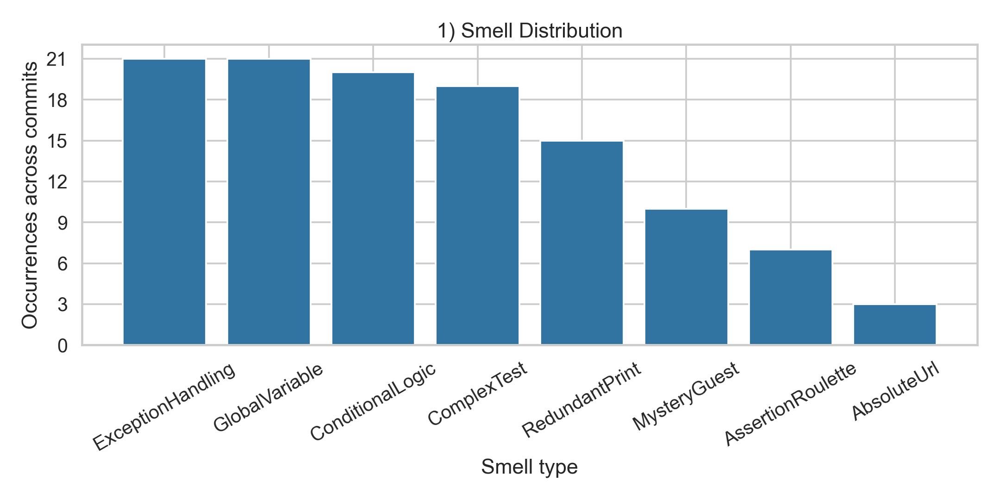
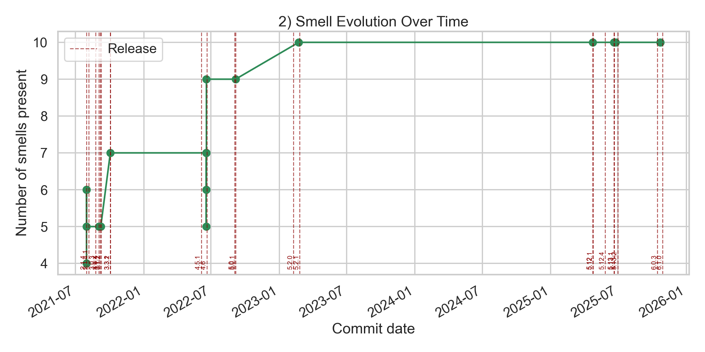
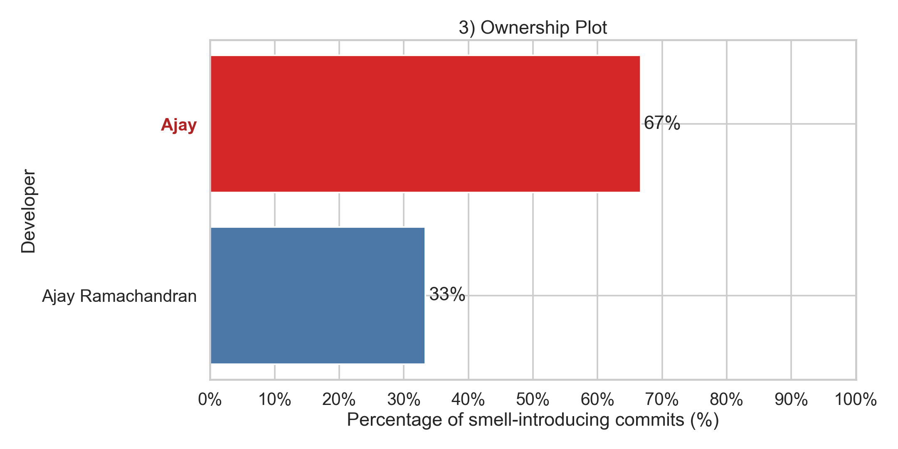
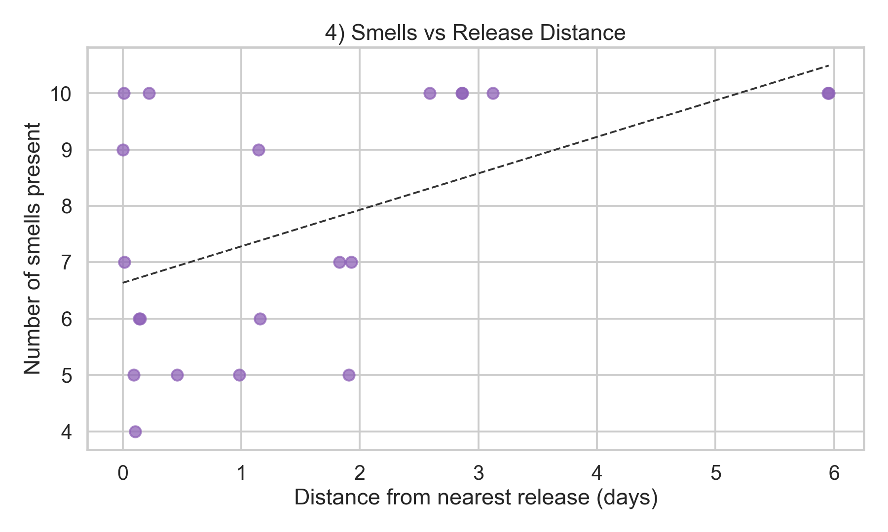
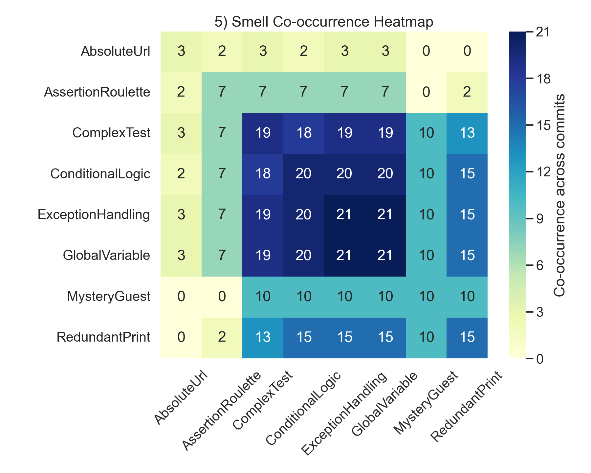

# 🔍 E2E Historical Test Smells Analyzer


⚠️ **Disclaimer**

This project **is not a final version of the tool**.

The codebase may contain:

* experimental implementations
* incomplete features
* potential bugs
* future changes and improvements

---

# 📄 Research Goal

The goal of this project is to support **empirical software engineering research** by analyzing how **End-to-End (E2E) test smells evolve over time in software repositories**.

Specifically, this tool aims to:

* detect **End-to-End test smells** in E2E test suites
* analyze their **historical evolution across commits**
* store the results in **structured databases for further analysis**
* use the collected structured data for **empirical studies**

# 📌 Project Overview

The system combines **static analysis** and **repository mining**.

Two main components are used:

1. **E2E Test Smell Detection**

A detector identifies smells inside test files.

2. **Historical Repository Mining**

The commit history of each repository is analyzed to understand **when smells appear and evolve**.

The final output is stored in **SQLite databases**.

---

# 📌 Architecture

The analysis pipeline follows these steps:

```
Repository Dataset
        │
        │
        ▼
E2E Test Smell Detector
(static analysis)
        │
        │
        ▼
CSV Files
(typescript_analysis.csv / javascript_analysis.csv)
        │
        │
        ▼
Historical Analyzer
(PyDriller commit mining)
        │
        │
        ▼
SQLite Databases
(historical_smellsJS.db / historical_smellsTS.db)
        │
        │
        ▼
Empirical analysis
(scripts and results in /analyses)
```

---

# 📌 Project Structure

```
project-root
│
├── analyses/
│  │
│  ├── e2e_smells_analyzer.py
│  ├── e2e_smells_report_plots.py
│  ├── e2e_empirical_analyzer.R
│  ├── R_scripts/
│  │  ├── main.R
│  │  └── jobs/
│  │     ├── 01_ridge_release.R
│  │     ├── 02_smells_catalog.R
│  │     ├── 03_startup_tables.R
│  │     └── 04_ownership_tables.R
│  │
│
├── history_smells-analyzerJS.py
├── history_smells-analyzerTS.py
├── requirements.txt
│
└── e2e-test-smell-analyzer/
```

---

# 🧪 Requirements

Before running the project ensure the following tools are installed:

* [Python 3.8+](https://www.python.org/)
* pip
* [Git](https://git-scm.com/)
* [R](https://www.r-project.org/)

---

# Setup Instructions

## 1. Download the E2E Test Smell Detector

Download the repository [**e2e-test-smell-analyzer**](https://github.com/squidslab/e2e-test-smell-analyzer) as a `.zip` file.

Then:

1. Extract the archive
2. Copy the folder into this project directory
3. Open a terminal and move inside the folder

```
cd e2e-test-smell-analyzer
```

---

# 2. Configure the Detector

Follow the instructions contained in the **README of the detector** in order to install its dependencies and configure the environment.

---

# 3. Generate Analysis Files

Once configured, run the detector to generate the following files:

```
typescript_analysis.csv
javascript_analysis.csv
```

These files contain the **detected E2E test smells**.

---

# 4. Install Python Dependencies

Move to the **root directory of this project** and run:

```
pip install -r requirements.txt
```

---

# 5. Run the Historical Analysis

Execute the following scripts:

```
python history_smells-analyzerJS.py
python history_smells-analyzerTS.py
```

These scripts will analyze the commit history of the repositories and collect information about the evolution of the detected test smells.

---

# 🔀 Output

The system generates two SQLite databases:

* **historical_smellsJS.db**
* **historical_smellsTS.db**

The databases include information such as:

* repository name
* test file path
* framework
* commit SHA
* commit date
* commit author
* commit message
* smell type
* nearest and earliest future release date
* nearest and earliest future release version
* class name
* method name
* line number

These datasets can later be used for **empirical analysis or statistical studies**.

---

# ✴️ Environment Variables (Optional)

The tool supports several environment variables to control the analysis.

| Variable             | Description                                       |
| -------------------- | ------------------------------------------------- |
| `E2E_TEST_MODE`      | Enables test mode with a reduced dataset          |
| `E2E_TEST_MAX_REPOS` | Maximum number of repositories to analyze         |
| `E2E_NUM_WORKERS`    | Number of parallel workers                        |
| `E2E_MAX_COMMITS`    | Maximum number of commits analyzed per repository |
| `E2E_DB_PATH`        | Path/name of the output database                  |
| `E2E_CLONE_ROOT`     | Directory where repositories are cloned           |

---

# ▶️ Example Execution (PowerShell)

```
$env:E2E_TEST_MODE='1'
$env:E2E_TEST_MAX_REPOS='1'
$env:E2E_NUM_WORKERS='2'

python history_smells-analyzer.py
```

This configuration:

* enables **test mode**
* analyzes **only one repository**
* uses **two parallel workers**

---


# 6. Empirical analysis tools

This section describes the scripts available in the `analyses/` folder for generating reports and visualizations from the historical databases.

---

## Analysis for a single repository/file:

The following section concerns the analysis and visualization of data for a single **repository/file**.


## a) Textual Report of Ownership and Smells

Script: `analyses/e2e_smells_analyzer.py`

Generates ownership/smell analytics for a test file and persists the results in SQLite.

The script uses the selected historical DB as the **main output** and stores structured report data in:

* `report_summary`
* `report_commit_details`
* `report_developer_details`

Text report generation (`.txt`) is **secondary** and only produced on request.

**▶️ Single execution (for a repository / specific file):**

```
python analyses/e2e_smells_analyzer.py <repository> <file_name> --dataset js/ts
```

Generate also a `.txt` file (optional):

```
python analyses/e2e_smells_analyzer.py <repository> <file_name> --dataset js/ts --output analyses/reports/js/my_report.txt
```

**⏩ Batch execution (all files with smells):**

```
python analyses/e2e_smells_analyzer.py --dataset js/ts
```

Generate also `.txt` reports in batch mode (optional):

```
python analyses/e2e_smells_analyzer.py --dataset js/ts --write-txt
```

**✴️ Main parameters:**

* `<repository>`: repository name as stored in the DB
* `<file_name>`: path or name of the test file
* `--dataset`: required, `js` or `ts`
* `--db`: (optional) path to the SQLite database
* `--report-db`: (optional) output DB path for report tables (default: same DB selected with `--db`/`--dataset`)
* `--output`: (optional, single mode) output `.txt` path
* `--write-txt`: (optional, batch mode) also generates `.txt` reports

**🔀 Output:**

* **Primary output**: report data saved in SQLite report tables.
* **Secondary output**: `.txt` files only when requested with `--output` (single mode) or `--write-txt` (batch mode), saved in `analyses/reports/<dataset>/`.

The summary now includes these transition metrics:

* `Introduction commits (new smells introduced)`
* `Improving commits (smells removed)`
* `Worsening commits (smells added)`

---

## b) Unified Plot Generation from Reports

Script: `analyses/e2e_smells_report_plots.py`

After creating textual reports with `analyses/e2e_smells_analyzer.py`, this script generates a complete set of 5 charts for each report file:


1. **Smell distribution**



2. **Smell evolution over time (with release lines)**



3. **Ownership plot**



4. **Smells vs release distance**



5. **Smell co-occurrence heatmap**



**▶️ Single execution (from one report):**

```
python analyses/e2e_smells_report_plots.py --report analyses/reports/ts/<report_file>.txt
```

**⏩ Batch execution (all reports):**

```
python analyses/e2e_smells_report_plots.py --reports-dir analyses/reports
```

**✴️ Main parameters:**

* `--report`: (optional) path to one report `.txt` file
* `--reports-dir`: (optional) root folder of report files (default: `analyses/reports`)
* `--output-root`: (optional) root output folder (default: `analyses/plots`)

**🔀 Output:**

Plots are saved under `analyses/plots/ts/` and `analyses/plots/js/`, inside one folder per repository/file (`<repo>_<file>`).

---

 ## Aggregated / multi-repository analysis:

The following section concerns statistical analyses and visualizations that aggregate data from all repositories/files, for a general study of the entire work.

**⚠️​ Note:** To run the scripts in this section you must first run `analyses/e2e_smells_analyzer.py`

## c) Empirical R Analysis (Aggregated JS/TS)

Script:

* `analyses/e2e_empirical_analyzer.R`

This script performs aggregated empirical analyses from `historical_smellsJS.db` and `historical_smellsTS.db`.

Main outputs include:

* **ridge plots** of signed distance (days) from closest release by transition type (`No-change`, `Initial`, `Improving`, `Worsening`)
* **release proximity summary tables**
* **startup-bin tables** by bad practice and variation type
* **ownership/newcomer tables** by bad practice and variation type
* **bad-smell incidence tables** (global by language and detailed by framework)

The script reads data from:

* `report_commit_details`
* `historical_smells`
* `report_developer_details`

in:

* `historical_smellsJS.db`
* `historical_smellsTS.db`

### R execution (single script)

From project root:

```powershell
Rscript analyses/e2e_empirical_analyzer.R
```

From `analyses/`:

```powershell
Rscript .\e2e_empirical_analyzer.R
```

Selective modes:

* `--ridge-release-only`
* `--smells-only`
* `--startup-tables-only`
* `--ownership-tables-only`
* `--incidence-only`

Incidence mode generates CSV summaries from both databases with:

* bad smell occurrences across all commits
* number of distinct test files affected by each bad smell
* split by language (JavaScript / TypeScript)
* split by framework inside each language

Optional parameters:

* `--js-db <path>`
* `--ts-db <path>`

### ▶️ R execution (modular pipeline + parallel)

Orchestrator script:

* `analyses/R_scripts/main.R`

Run all jobs sequentially:

```powershell
Rscript analyses/R_scripts/main.R
```

Run all jobs in parallel:

```powershell
Rscript analyses/R_scripts/main.R --parallel --workers 2
```

Run one specific job:

```powershell
Rscript analyses/R_scripts/main.R --only ridge
Rscript analyses/R_scripts/main.R --only smells
Rscript analyses/R_scripts/main.R --only startup
Rscript analyses/R_scripts/main.R --only ownership
```

✴️ Main options for `main.R`:

* `--parallel`
* `--workers <n>`
* `--only ridge|smells|startup|ownership`
* `--js-db <path>`
* `--ts-db <path>`

### 🔀 Output files (examples)

* `analyses/plots/release_distance_ridge_js_R.png`
* `analyses/plots/release_distance_ridge_ts_R.png`
* `analyses/plots/release_cycle_proximity_summary_js_R.png`
* `analyses/plots/release_cycle_proximity_summary_ts_R.png`
* `analyses/plots/test_smells_catalog_table_R.png`
* `analyses/plots/startup_bins_by_bp_variation_js_R.png`
* `analyses/plots/startup_bins_by_bp_variation_ts_R.png`
* `analyses/plots/ownership_newcomer_by_bp_variation_js_R.png`
* `analyses/plots/ownership_newcomer_by_bp_variation_ts_R.png`
* `analyses/reports/bad_smells_incidence_language_R.csv`
* `analyses/reports/bad_smells_incidence_framework_R.csv`

---

**⚠️​ Note:** All scripts support both single mode (specific repository/file) and batch mode (all files with smells in the DB). In case of errors, check that the database exists and that the parameters are correct.

---

# 🚹 Contributors

* Vincenzo Di Nardo